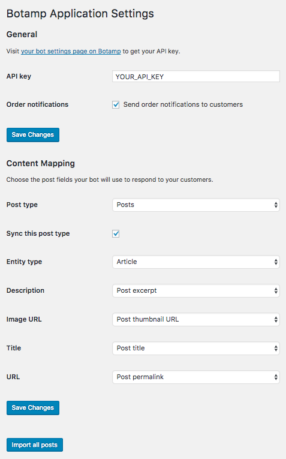

# Botamp plugin for WordPress

Botamp is the best way to do marketing automation on Facebook Messenger. Run personalized messaging campaigns at scale, increase your audience and revenue.

You can sign up for a Botamp account at https://botamp.com.

The Botamp plugin for WordPress makes it easy to sync your WordPress site content with Botamp.

It also makes it easy to enable order notifications for your customers on your Woocommerce site so that they can receive
messages from your Facebook page whenever their order status changes.

This plugin uses the [Botamp PHP SDK](https://github.com/botamp/botamp-php), to interact with the [Botamp API](https://app.botamp.com/docs/api).

## Requirements

PHP 5.6 and later (previous PHP versions may work but untested), HHVM.

## Settings
1. Enter your Botamp API key
2. Choose the post types to sync with Botamp
3. Choose the post fields to sync for each post type

## Features

### Create content
Sync to Botamp every time a post is created.

### Update content
The content on Botamp is automatically updated whenever the corresponding post is updated.

### Delete content
The content on Botamp is automatically deleted whenever the corresponding post is deleted.

### Import all of your products
By clicking on the **Import all posts** button, you can import all of your existing posts into your bot.

### Order notifications
By enabling order notifications, your customers can opt-in to receive messages from your Facebook page whenever their order status changes.
